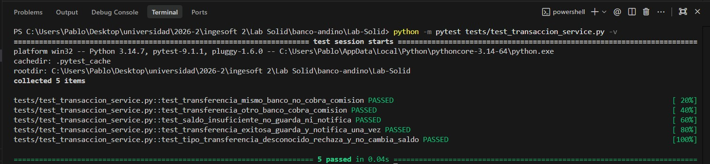

# Lab-Solid
Repositorio para el Laboratorio de SOLID de la materia Ingeniería de Software II G3 del Departamento de Ingeniería de Sistemas e Industrial - Facultad de Ingeniería de la Universidad Nacional de Colombia.

**Lenguaje elegido:** Python (traducción 1:1 del código base en Java, conservando los defectos de diseño).

## Miembros del Equipo de trabajo

* Pablo Andres Niño Barreto (pninob@unal.edu.co)
* Sergio Tovar Vasquez (setovarv@unal.edu.co)


## Bloque 0 - Commit Inicial - Traducción de Java a Python 
Se subió el bloque 0 del laboratorio, que incluye la traducción de los códigos del laboratorio, originalmente en Java y traducidos a Python. La salida del programa principal quedó congelada en `salida_original.txt` como prueba de caracterización.

---

## Bloque 1 — Diagnóstico

Objetivo: **encontrar los problemas de diseño y medir el "antes"**, sin corregir nada todavía. Todas las evidencias, salidas y métricas de esta sección se obtuvieron ejecutando el código real de este repositorio.

### 1.1 Tabla de hallazgos

Hay al menos un problema por cada letra de SOLID; algunas clases acumulan varios. La columna de **consecuencia** está escrita en términos del negocio (qué le pasa al banco o al cliente).

| Clase / método | Letra | Evidencia en el código | Consecuencia para el banco o el cliente |
|---|:---:|---|---|
| `TransaccionService.transferir` (`transaccion_service.py`, líneas 11–47) | **S** | Un mismo método valida montos, calcula la comisión, mueve el dinero, persiste en Oracle, imprime el comprobante, envía el SMS y registra la auditoría (7 bloques comentados `# 1.` a `# 7.`). | Si el área legal pide cambiar el **texto del comprobante**, hay que tocar el mismo método que **mueve el dinero**. Un error al editar el comprobante puede terminar cobrando mal una transferencia o duplicando un cargo en producción. |
| `TransaccionService.transferir` (`transaccion_service.py`, líneas 19–26) | **O** | La comisión se decide con un `if/elif/else` sobre `tipo`: `MISMO_BANCO`, `OTRO_BANCO`, `INTERNACIONAL`. | Cada vez que el negocio lanza un **tipo nuevo de transferencia** (por llave, por ejemplo) hay que **abrir y modificar la clase central** que mueve el dinero. Cada cambio arriesga romper los tipos que ya funcionaban. |
| `CDT` hereda de `Cuenta` y sobreescribe `retirar` (`cdt.py`, líneas 9–11) | **L** | `CDT` extiende `Cuenta` pero **sobreescribe `retirar()` para lanzar `RuntimeError`** si aún no ha vencido. No cumple el contrato de su clase padre. | Cualquier proceso que trate un `CDT` como una `Cuenta` y llame `retirar()` **se cae**. El cobro masivo de cuota de manejo revienta al llegar al primer CDT (ver Experimento 1, con traceback real). |
| `CobroCuotaManejo.cobrar_mensual` (`cobro_cuota_manejo.py`, líneas 7–10) | **L** | Recorre una lista de `Cuenta` y llama `retirar()` asumiendo que **todas** permiten retirar, lo cual es falso para `CDT`. | En el batch nocturno de un millón de cuentas, basta **un** CDT en la lista para detener todo el proceso a mitad de camino: unas cuentas quedan cobradas y otras no. |
| `ProductoBancario` (`producto_bancario.py`, líneas 3–21) | **I** | Interfaz "gorda" (`ABC`) con 5 métodos abstractos obligatorios: `depositar`, `retirar`, `calcular_intereses`, `pagar_cuota`, `generar_extracto`. | Los implementadores quedan obligados a definir métodos que no les sirven. Peor: un `CreditoVivienda.depositar()` **vacío** acepta la llamada y **no hace nada** — el dinero "entra" sin error y desaparece silenciosamente. |
| `TransaccionService.__init__` (`transaccion_service.py`, líneas 7–9) | **D** | Crea sus dependencias directamente: `self._repositorio = OracleRepositorio()` y `self._sms = SmsGateway()`. | Es **imposible probar** una transferencia sin conectarse a la base de producción ni enviar un SMS real al cliente (ver Experimento 2). Migrar de Oracle a otro motor obliga a editar esta clase. |

**Hallazgos adicionales (clases con evidencia de apoyo):**

| Clase / método | Letra | Evidencia en el código | Consecuencia para el banco o el cliente |
|---|:---:|---|---|
| `Cuenta.retirar` (`cuenta.py`, líneas 21–24) | **L** | La clase base promete `retirar()` incondicional para **toda** cuenta; de ahí nace la violación del CDT. | El contrato mal diseñado en la raíz es lo que permite que un subtipo (CDT) no pueda cumplirlo. |
| `TarjetaCredito.depositar` (`tarjeta_credito.py`, línea 9) | **I** | Método vacío: `pass  # No aplica`. | Una tarjeta de crédito "acepta" un depósito que no hace nada: comportamiento engañoso para quien consume la interfaz. |
| `CreditoVivienda.depositar` y `CreditoVivienda.retirar` (`credito_vivienda.py`, líneas 7–11) | **I** | Dos métodos vacíos: `pass  # No aplica`. | Mismo riesgo de operación silenciosa que no falla pero tampoco ejecuta nada. |

### 1.2 Dos experimentos

#### Experimento 1 — El CDT

**Qué hicimos:** agregamos el CDT de Ana a la lista de `CobroCuotaManejo.cobrar_mensual`. El script está en `experimentos/experimento1_cdt.py`.

> **Nota de fidelidad:** en `main.py` el CDT se crea con `vencimiento=date(2026, 9, 30)`, una fecha **ya vencida** hoy; eso haría que el CDT se comporte como "ya liberado" y el experimento **no** fallaría. El Java original usa `LocalDate.now().plusMonths(6)` (siempre a futuro). Para que el experimento sea fiel al enunciado, el script usa un CDT **no vencido** (`date.today() + 180 días`). *Recomendación:* corregir esa fecha en `main.py` para que la traducción sea fiel (ver nota al final).

**Qué pasa (traceback real):**

```
>>> Lista a cobrar: [ana, cdt_ana, luis]
Cuota de manejo cobrada a 001-1
Traceback (most recent call last):
  File "experimentos/experimento1_cdt.py", line 12, in <module>
    CobroCuotaManejo().cobrar_mensual([ana, cdt_ana, luis])
  File "cobro_cuota_manejo.py", line 9, in cobrar_mensual
    cuenta.retirar(self.CUOTA)
  File "cdt.py", line 11, in retirar
    raise RuntimeError("Un CDT no permite retiros antes del vencimiento")
RuntimeError: Un CDT no permite retiros antes del vencimiento
```

Se cobra la cuota a `001-1` (Ana), el proceso llega al CDT, invoca `retirar()`, el CDT lanza `RuntimeError` y el programa **se detiene**: **`001-2` (Luis) nunca recibe el cobro**. El recorrido muere en el elemento problemático y no continúa.

**Qué pasaría en producción:** si el batch corre de noche sobre **un millón de cuentas** y la cuenta número **500 000 es un CDT**, el proceso cobra correctamente las primeras 499 999, explota en la 500 000 y **deja sin cobrar las 500 000 restantes**. Resultado: cierre contable inconsistente (medio banco cobrado, medio no) y una falla que probablemente nadie note hasta la conciliación. Un único dato "raro" tumba todo el proceso.

#### Experimento 2 — La prueba imposible

**Qué intentamos:** escribir una prueba que verifique que una transferencia a otro banco cobra $7 500 de comisión, **sin conectarse a Oracle ni enviar SMS**. El script está en `experimentos/test_prueba_imposible.py`.

**Qué pasó al ejecutarla (salida real de `pytest -s`):**

```
[ORACLE] Conectando a jdbc:oracle:thin:@prod-db:1521/BANCO...
[ORACLE] INSERT INTO transacciones VALUES ('001-1', '001-2', 100000, 7500.0)
===== BANCO ANDINO - COMPROBANTE =====
Origen: 001-1
Destino: 001-2
Monto: $100000
Comisión: $7500.0
=====================================
[SMS] Conectando al proveedor de mensajeria...
[SMS] Para Ana: Transferiste $100000 a la cuenta 001-2
[AUDITORIA] 2026-10-01 ... OTRO_BANCO 001-1->001-2 $100000
.
1 passed in 0.01s
```

**¿Lo logramos?** **No.** El `assert` sobre la comisión sí pasa, pero la prueba **no pudo evitar** que se ejecutaran el repositorio y el SMS: en la salida aparecen `[ORACLE] Conectando a ... prod-db ...` y `[SMS] Conectando al proveedor ...`.

**¿Qué lo impide?** `TransaccionService.__init__` **crea sus dependencias adentro** (`OracleRepositorio()` y `SmsGateway()`). No hay ningún punto (parámetro ni setter) por donde inyectar una versión falsa. Por eso, cada corrida de la prueba:

- Golpea la "base de producción" (`[ORACLE] Conectando a jdbc:oracle:thin:@prod-db...`).
- Envía un "SMS real" al cliente (`[SMS] Para Ana...`).

Capturar la consola no desacopla nada: seguimos conectando a Oracle y mandando SMS en cada corrida. Este es el síntoma exacto del problema **D (DIP)**, que se resuelve en el Punto de control D del Bloque 2.

### 1.3 Medición "antes"

| Métrica | Antes |
|---|:---:|
| Líneas del método `transferir` | **23 líneas de código** (cuerpo de 36 líneas: 23 de código + 7 comentarios + 6 en blanco) |
| Número de razones distintas por las que `TransaccionService` podría cambiar | **7** (validación · comisión · movimiento de dinero · persistencia · comprobante · notificación · auditoría) |
| Clases concretas que `TransaccionService` instancia directamente (`new`) | **2** (`OracleRepositorio`, `SmsGateway` — líneas 8–9) |
| Métodos vacíos o que lanzan excepción por "no aplica" | **3 vacíos** (`TarjetaCredito.depositar`, `CreditoVivienda.depositar`, `CreditoVivienda.retirar`) **+ 1 que lanza excepción** (`CDT.retirar`) |
| ¿Se puede probar `transferir` sin Oracle ni SMS? | **No** (demostrado en el Experimento 2) |

### 1.4 Diagrama de clases del código original

Diagrama UML del código base. En **rojo** se marcan las herencias y dependencias problemáticas (las que causan las violaciones SOLID). Este bloque Mermaid se renderiza automáticamente en GitHub.

```mermaid
classDiagram
    direction TB

    class Cuenta {
        #numero
        #titular
        #saldo
        +depositar(monto)
        +retirar(monto)
    }
    class CuentaAhorros
    class CDT {
        -vencimiento
        +retirar(monto)
    }
    class TransaccionService {
        -repositorio
        -sms
        +transferir(origen, destino, monto, tipo)
    }
    class OracleRepositorio {
        +guardar_transaccion(origen, destino, monto, comision)
    }
    class SmsGateway {
        +enviar(destinatario, mensaje)
    }
    class CobroCuotaManejo {
        +cobrar_mensual(cuentas)
    }
    class ProductoBancario {
        <<abstract>>
        +depositar(monto)
        +retirar(monto)
        +calcular_intereses()
        +pagar_cuota(monto)
        +generar_extracto()
    }
    class TarjetaCredito {
        -deuda
        -cupo
        +depositar(monto)
        +retirar(monto)
        +calcular_intereses()
        +pagar_cuota(monto)
        +generar_extracto()
    }
    class CreditoVivienda {
        -saldo_pendiente
        +depositar(monto)
        +retirar(monto)
        +calcular_intereses()
        +pagar_cuota(monto)
        +generar_extracto()
    }
    class Main {
        +main()
    }

    Cuenta <|-- CuentaAhorros
    Cuenta <|-- CDT
    ProductoBancario <|-- TarjetaCredito
    ProductoBancario <|-- CreditoVivienda
    TransaccionService ..> OracleRepositorio : new
    TransaccionService ..> SmsGateway : new
    TransaccionService ..> Cuenta : usa
    CobroCuotaManejo ..> Cuenta : retirar()
    Main ..> TransaccionService : new
    Main ..> CobroCuotaManejo : new
    Main ..> CuentaAhorros : new
    Main ..> CDT : new
    Main ..> TarjetaCredito : new
    Main ..> CreditoVivienda : new

    classDef problema fill:#ffe3e3,stroke:#d00000,stroke-width:2px,color:#660000;
    class CDT problema
    class TransaccionService problema
    class ProductoBancario problema

    linkStyle 1 stroke:#d00000,stroke-width:2px
    linkStyle 2 stroke:#d00000,stroke-width:2px
    linkStyle 3 stroke:#d00000,stroke-width:2px
    linkStyle 4 stroke:#d00000,stroke-width:2px
    linkStyle 5 stroke:#d00000,stroke-width:2px
    linkStyle 7 stroke:#d00000,stroke-width:2px
```

**Lectura del diagrama (qué está en rojo y por qué):**

- `CDT ──▷ Cuenta` (herencia) → **LSP**: el subtipo no cumple el contrato de `retirar()`.
- `CobroCuotaManejo ┄> Cuenta` (`retirar()`) → punto donde la violación LSP **explota** en ejecución.
- `TarjetaCredito ┄▷ ProductoBancario` y `CreditoVivienda ┄▷ ProductoBancario` → **ISP**: obligan a implementar métodos vacíos.
- `TransaccionService ┄> OracleRepositorio` y `┄> SmsGateway` (ambas con `new`) → **DIP**: dependen de clases concretas creadas adentro.
- `TransaccionService` (nodo rojo) → **SRP + OCP**: concentra 7 responsabilidades y el `if/elif` por tipo.
- `ProductoBancario` (nodo rojo) → **ISP**: interfaz gorda.

Las dependencias de `Main` hacia las clases concretas quedan en negro: `Main` es el punto de armado del sistema, y ahí sí es legítimo instanciar (eso se refuerza en el Punto de control D).

---


## Bloque 2 — Refactorización

En este bloque se refactoriza el sistema aplicando los principios SOLID de forma progresiva, manteniendo el comportamiento original del programa.

Después de cada punto de control se compara la salida del programa con `salida_original.txt` para verificar que la refactorización no haya alterado su comportamiento.

### Punto de Control S — Single Responsibility Principle

En el código original, el método `transferir()` de `TransaccionService` concentraba diferentes responsabilidades dentro de una misma clase:

1. Validación del monto.
2. Cálculo de la comisión.
3. Movimiento del dinero entre las cuentas.
4. Persistencia de la transacción.
5. Generación del comprobante.
6. Notificación mediante SMS.
7. Registro de auditoría.

Esta concentración hacía que `TransaccionService` tuviera múltiples razones para cambiar. Por ejemplo, un cambio en el formato del comprobante o en la forma de realizar la auditoría obligaría a modificar la misma clase encargada de coordinar la transferencia.

Para aplicar el principio de Responsabilidad Única (SRP), se separaron varias de estas responsabilidades en clases independientes:

- `ValidadorTransferencia`: se encarga de validar el monto de la transferencia.
- `CalculadorComision`: se encarga de calcular la comisión según el tipo de transferencia.
- `GeneradorComprobante`: se encarga de generar e imprimir el comprobante.
- `AuditorTransferencia`: se encarga de registrar la auditoría de la operación.

De esta forma, `TransaccionService` pasó a encargarse principalmente de coordinar el flujo de una transferencia utilizando los componentes especializados.

#### Estructura después de aplicar SRP

```text
TransaccionService
├── ValidadorTransferencia
├── CalculadorComision
├── GeneradorComprobante
├── AuditorTransferencia
├── OracleRepositorio
└── SmsGateway
```

### Punto de Control O — Open/Closed Principle

En el código original, el cálculo de la comisión dependía de una
estructura condicional que verificaba el tipo de transferencia.
Para agregar un nuevo tipo era necesario modificar el código
existente de `CalculadorComision`.

Para aplicar el principio Abierto/Cerrado (OCP), se creó la
abstracción `TipoTransferencia`, que define el comportamiento que
debe tener cada tipo de transferencia.

Se implementaron las siguientes clases:

- `TransferenciaMismoBanco`
- `TransferenciaOtroBanco`
- `TransferenciaInternacional`

Cada una implementa su propia forma de calcular la comisión.

`CalculadorComision` ahora depende de la abstracción
`TipoTransferencia` y simplemente delega en ella el cálculo:

```python
def calcular(self, monto: float, tipo: TipoTransferencia) -> float:
    return tipo.calcular_comision(monto)
```

### Punto de Control L — Sustitución de la jerarquía de cuentas

#### Problema encontrado

La clase `Cuenta` original definía la operación `retirar()`, por lo que todas sus subclases debían cumplir con este comportamiento.

Esto generaba un problema con `CDT`, ya que un CDT no permite retiros antes de su fecha de vencimiento. Por lo tanto, `CDT` no puede cumplir correctamente el contrato de una cuenta que permite retirar dinero en cualquier momento.

El problema corresponde al principio de **Liskov Substitution Principle (LSP)**: una subclase debe poder utilizarse donde se espera su clase base sin romper las expectativas del programa.

#### Refactorización realizada

Se separó la capacidad de retirar dinero de la clase general `Cuenta`.

Se creó:

```text
Cuenta
   ├── CuentaRetirable
   │      └── CuentaAhorros
   │
   └── CDT
```
### Control I — Interface Segregation Principle (ISP)

#### Problema encontrado

La interfaz `ProductoBancario` original obligaba a todos los productos a implementar los siguientes métodos:

- `depositar()`
- `retirar()`
- `calcular_intereses()`
- `pagar_cuota()`
- `generar_extracto()`

Esto generaba métodos que no aplicaban a determinados productos. Por ejemplo, `TarjetaCredito` tenía que implementar `depositar()` aunque esta operación no correspondía a una tarjeta de crédito. De igual manera, `CreditoVivienda` tenía que implementar `depositar()` y `retirar()` aunque estas operaciones no aplicaban a este producto.

#### Refactorización realizada

Se redujo la interfaz `ProductoBancario` para que únicamente defina la operación común a todos los productos:

```python
class ProductoBancario(ABC):
    @abstractmethod
    def generar_extracto(self) -> str:
        pass
```
### Control D — Dependency Inversion Principle (DIP)

#### Problema encontrado

Inicialmente, `TransaccionService` creaba directamente sus dependencias de infraestructura:

- `OracleRepositorio`
- `SmsGateway`

Esto generaba un acoplamiento entre la lógica de negocio y las implementaciones concretas de persistencia y mensajería.

#### Refactorización realizada:

Se crearon las abstracciones:

- `RepositorioTransacciones`
- `Notificador`

`OracleRepositorio` ahora implementa `RepositorioTransacciones`, mientras que `SmsGateway` implementa `Notificador`.

Posteriormente, `TransaccionService` fue modificado para recibir estas dependencias mediante su constructor.

De esta forma, el servicio ya no decide qué implementación concreta utilizar.

#### Inyección de dependencias

El armado de las dependencias se trasladó a `main.py`.

El programa principal es ahora responsable de crear:

- `OracleRepositorio`
- `SmsGateway`
- `ValidadorTransferencia`
- `CalculadorComision`
- `GeneradorComprobante`
- `AuditorTransferencia`

y posteriormente inyectarlos en `TransaccionService`.

Esto permite cambiar las implementaciones sin modificar la lógica del servicio.

#### Prueba con dobles

Para comprobar que la inversión de dependencias funciona, se creó:

`experimentos/experimento2_dip.py`

En este experimento se utilizaron:

- `FakeRepositorio`
- `FakeNotificador`

en lugar de `OracleRepositorio` y `SmsGateway`.

El resultado fue:

- Saldo de Ana: `$1.850.000`
- Saldo de Luis: `$650.000`
- Transacciones guardadas: `1`
- Notificaciones enviadas: `1`

Además, durante esta prueba no se realizaron conexiones al repositorio Oracle ni al proveedor de SMS.

Esto demuestra que `TransaccionService` puede probarse utilizando dobles de prueba sin depender de las implementaciones concretas de infraestructura.

## Bloque 3 — Pruebas unitarias

### Pruebas implementadas

Se utilizó `pytest` junto con dobles de prueba (`FakeRepositorio` y `FakeNotificador`) para probar `TransaccionService` sin conectarse a Oracle ni enviar SMS.

Se implementaron las cinco pruebas solicitadas:

1. **Transferencia al mismo banco:** verifica que no se cobre comisión y que el monto transferido se descuente y deposite correctamente.
2. **Transferencia a otro banco:** verifica una comisión de `$7.500` y que se descuente del origen el monto más la comisión.
3. **Saldo insuficiente:** verifica que la operación sea rechazada, que los saldos no cambien y que no se guarde ni notifique la transferencia.
4. **Transferencia exitosa:** verifica que la transacción se guarde exactamente una vez y que se genere exactamente una notificación.
5. **Tipo de transferencia desconocido:** verifica que la operación sea rechazada y que el saldo de origen permanezca sin cambios.

### Resultado

Las cinco pruebas fueron ejecutadas mediante `pytest`:


## Bloque 4 — Nuevos requerimientos de negocio

En este bloque se aplicaron cinco requerimientos de negocio sobre el código ya refactorizado. El objetivo era comprobar que, gracias al diseño SOLID, cada cambio se resuelve agregando clases nuevas y afectando la menor cantidad posible de código existente, sin volver a tocar la lógica central de `TransaccionService`.

A diferencia del Bloque 2, aquí la salida del programa **sí cambia respecto a `salida_original.txt`**, porque los requerimientos agregan comportamiento nuevo (notificación push, reporte antifraude, persistencia en PostgreSQL). Lo que no cambia son las pruebas unitarias del Bloque 3, que siguen pasando sin modificación alguna (criterio de aceptación de R5).

### R1 — Transferencias por llave

Se agregó la clase `TransferenciaLlave`, que implementa la abstracción `TipoTransferencia` con comisión de `$0`. No se modificó ninguna clase existente: se aprovechó el patrón Estrategia introducido en el Punto de control O del Bloque 2. La búsqueda de la cuenta a partir de la llave no se implementa, según lo indicado en el enunciado.

- Clases nuevas: `transferencia_llave.py`
- Clases modificadas: ninguna (solo el armado de la demostración en `main.py`)

Criterio de aceptación verificado: una transferencia de tipo `LLAVE` por `$50.000` descuenta exactamente `$50.000` de la cuenta de origen (comisión `$0`).

### R2 — Cuenta infantil

Se agregó la clase `CuentaInfantil`, que hereda de `CuentaRetirable`. Recibe depósitos sin límite y limita los retiros a `$200.000` en un mismo día, llevando un acumulado diario que se reinicia al cambiar la fecha. Al heredar de `CuentaRetirable` puede usarse como origen de transferencias y se le cobra la cuota de manejo como a cualquier cuenta retirable.

- Clases nuevas: `cuenta_infantil.py`
- Clases modificadas: ninguna

Criterio de aceptación verificado: si la cuenta ya retiró `$150.000` hoy, un retiro de `$60.000` se rechaza (`$150.000 + $60.000 > $200.000`) y el saldo no cambia.

### R3 — Notificaciones push

Se agregó `PushNotifier`, que implementa la misma abstracción `Notificador` que `SmsGateway`, y `NotificadorCompuesto`, que aplica el patrón Composite para agrupar varios notificadores y tratarlos como uno solo. En `main.py` se inyecta `NotificadorCompuesto([SmsGateway(), PushNotifier()])`. Gracias a esto, **`TransaccionService` no cambia**: sigue recibiendo un único `Notificador`.

- Clases nuevas: `push_notifier.py`, `notificador_compuesto.py`
- Clases modificadas: ninguna (solo el armado en `main.py`)

Criterio de aceptación verificado: por cada transferencia exitosa aparecen en consola un mensaje `[SMS]` y un mensaje `[PUSH]`.

### R4 — Sistema antifraude

Se agregó la abstracción `ObservadorTransaccion` y la clase `AntifraudeService`, que la implementa y reporta cada transacción exitosa (mensaje `[ANTIFRAUDE]`). `TransaccionService` recibe una lista opcional de observadores y los invoca al final del flujo, después de la auditoría, solo cuando la transferencia fue exitosa. El parámetro es opcional y por defecto una lista vacía, de modo que la auditoría actual se mantiene y las pruebas del Bloque 3 no cambian.

- Clases nuevas: `observador_transaccion.py`, `antifraude_service.py`
- Clases modificadas: `transaccion_service.py` (se añadió un punto de extensión por observadores, sin alterar el cálculo central)

Criterio de aceptación verificado: por cada transferencia exitosa aparecen un mensaje `[AUDITORIA]` y uno `[ANTIFRAUDE]`; una transferencia rechazada no genera ninguno de los dos, porque el servicio lanza la excepción antes de llegar a ese punto.

### R5 — Migración a PostgreSQL

Se agregó `PostgresRepositorio`, que implementa la misma abstracción `RepositorioTransacciones` que `OracleRepositorio`. La migración consistió únicamente en inyectar la nueva clase en lugar de la de Oracle desde `main.py`. La clase `OracleRepositorio` se conserva intacta por si hay que devolverse durante la migración.

- Clases nuevas: `postgres_repositorio.py`
- Clases modificadas: ninguna (`OracleRepositorio` no se toca; solo el armado en `main.py`)

Criterio de aceptación verificado: el programa guarda en PostgreSQL (mensaje `[POSTGRES]`) y las cinco pruebas unitarias del Bloque 3 siguen pasando sin cambios.

### Tabla: estimación vs. realidad de archivos modificados

La columna de estimación corresponde a cuántos archivos habría que tocar en el **código original** (monolítico) del Bloque 0, donde casi todo pasaba por la clase `TransaccionService`. La columna real corresponde a lo que efectivamente se hizo sobre el **código refactorizado**.

| Req | Estimado en el código original | Real en el código refactorizado | Clase núcleo modificada |
|---|:---:|---|:---:|
| R1 | 1 (modificar el `switch` de comisiones en `TransaccionService`) | 1 clase nueva, 0 clases modificadas | No |
| R2 | 1–2 (nueva clase + ajustes en la jerarquía de cuentas) | 1 clase nueva, 0 clases modificadas | No |
| R3 | 2 (modificar `TransaccionService` + nueva clase push) | 2 clases nuevas, 0 clases modificadas | No |
| R4 | 2 (modificar `TransaccionService` + nueva clase antifraude) | 2 clases nuevas, 1 clase modificada (punto de extensión) | Sí (aditivo) |
| R5 | 2 (modificar `TransaccionService`/`main` + nueva clase repositorio) | 1 clase nueva, 0 clases modificadas | No |

En el código original, cuatro de los cinco requerimientos (R1, R3, R4, R5) habrían obligado a modificar la misma clase central `TransaccionService`, con el riesgo de romper lo que ya funcionaba. En el código refactorizado, cuatro de los cinco se resolvieron **solo agregando clases nuevas**, sin tocar ninguna clase núcleo. El único cambio sobre `TransaccionService` (R4) fue aditivo: un parámetro opcional que no altera el cálculo central ni rompe las pruebas existentes. Los cambios restantes se concentraron en `main.py`, que es el punto de armado (composición) del sistema y donde es legítimo decidir qué implementaciones concretas se inyectan.

### Commits del bloque

`req-1`, `req-2`, `req-3`, `req-4`, `req-5`.
